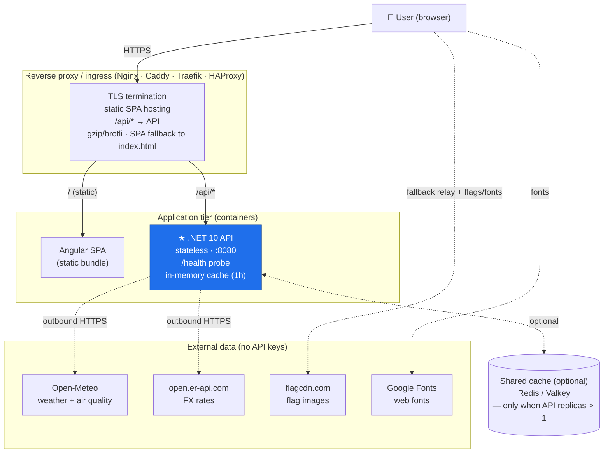

# WeatherApplication — Architecture (vendor-neutral)

A cloud-agnostic view of the same two deployable units described in
[AWS_ARCHITECTURE.md](cloud/AWS_ARCHITECTURE.md), but expressed **without any AWS
(or other proprietary) service** — only portable building blocks you can run on
a single VM, on-prem, in Docker Compose, or on Kubernetes.

- **Angular SPA** — static assets (`index.html`, hashed JS/CSS).
- **.NET 10 API** — stateless container, owns *all* business logic.
- **Reverse proxy** — TLS, serves the SPA, proxies `/api/*` to the API.

The golden rule holds everywhere: **the browser carries no business logic**; it
only renders what the API returns (and, in the fallback path, relays raw upstream
responses back for the API to process).

---

## 1. High-level diagram



**Fallback path:** if the API host can't reach Open-Meteo/FX, `GET /api/regions`
returns placeholder rows; the SPA detects this, fetches coordinates from
`/api/countries`, calls the upstreams from the browser, and POSTs the raw results
to `POST /api/regions/merge`. The API still performs *all* merge / classification.
In a normal deployment (API has egress) the fallback never fires.

---

## 2. Components (portable equivalents)

| Layer | Portable building block | Role | AWS equivalent (for reference) |
| ----- | ----------------------- | ---- | ------------------------------ |
| DNS | Any DNS provider | Domain → proxy | Route 53 |
| TLS | Let's Encrypt / internal CA | HTTPS certificates | ACM |
| Edge / static | **Nginx / Caddy / Traefik** | Serve SPA, proxy API, SPA-route to `index.html` | CloudFront + S3 |
| API compute | **Docker container** on VM / Compose / **Kubernetes** | Runs the .NET API, autoscale via replicas | App Runner |
| Image registry | Any OCI registry (Harbor, GHCR, GitLab, Docker Hub) | Stores the API image | ECR |
| CI/CD | Any runner (GitHub Actions, GitLab CI, Jenkins) | Test → build/push image → deploy → publish SPA | GitHub Actions + OIDC |
| Cache (opt.) | **Redis / Valkey** | Shared cache when replicas > 1 | ElastiCache |
| Monitoring | **Prometheus + Grafana + Loki** (or ELK) | Metrics, logs, dashboards, alerts | CloudWatch + SNS |
| Secrets (opt.) | HashiCorp Vault / sealed secrets / env | Secrets if keyed upstreams are added | Secrets Manager |
| WAF (opt.) | ModSecurity / Traefik middleware | Edge protection / rate-limit | AWS WAF |

---

## 3. Request flows

**A. First page load**
1. DNS resolves the domain → reverse proxy.
2. Proxy serves `index.html` + hashed JS/CSS (static bundle), with SPA fallback
   routing unknown paths to `index.html`.
3. Angular boots, detects the browser locale, and calls the API.

**B. Live data**
1. SPA → `GET /api/regions` (same origin via the proxy, or a CORS-allowed origin).
2. API returns cached, merged data (weather + air + currency).
3. On cache miss the API fetches Open-Meteo + FX, merges, and caches (1h).

**C. Fallback** (API host has no egress)
1. `GET /api/regions` returns placeholders → SPA detects no live data.
2. SPA fetches `/api/countries`, calls Open-Meteo + FX from the browser, POSTs raw
   results to `/api/regions/merge` → API merges/classifies.

**D. Deploy**
1. Push to `main` → CI runs backend tests + frontend build/tests.
2. Build the API image, push to the registry, roll the API deployment.
3. Build the SPA (injecting the API base URL), publish static assets behind the proxy.

---

## 4. Deployment topologies

### 4a. Single host — Docker Compose (simplest)
```
┌───────────────────────── Host / VM ─────────────────────────┐
│  reverse-proxy (Nginx/Caddy)  :443  ── TLS, static SPA, /api │
│        │ serves /dist                    │ proxy_pass         │
│        ▼                                  ▼                    │
│   [ SPA static files ]              [ api container :8080 ]   │
│                                     [ redis :6379 (optional) ]│
└──────────────────────────────────────────────────────────────┘
```
One `docker compose up`: proxy + API (+ optional Redis). The SPA is built to a
static folder the proxy serves. Good for demos, small prod, on-prem.

### 4b. Kubernetes (scale / HA)
- **Ingress controller** (Nginx/Traefik) + **cert-manager** for TLS.
- **API** as a `Deployment` (N replicas) + `Service`, `readiness`/`liveness` on `/health`,
  scaled by an `HorizontalPodAutoscaler`.
- **SPA** served either by the ingress from a static volume/CDN or a tiny Nginx pod.
- **Redis/Valkey** `StatefulSet` (or managed) as the shared cache so replicas stay
  within upstream rate limits.
- **Prometheus/Grafana/Loki** for observability.

---

## 5. Configuration (environment variables)

| Variable | Purpose |
| -------- | ------- |
| `Cors__AllowedOrigins__0` | The real SPA origin (not `*`). Behind a same-origin proxy this can be the public URL. |
| `ASPNETCORE_FORWARDEDHEADERS_ENABLED=true` | Honour `X-Forwarded-Proto` so HTTPS redirect doesn't loop behind TLS termination. |
| `ASPNETCORE_URLS` / container port | API listens on `:8080` in the container. |
| SPA `API_BASE_URL` (build-time) | Point the SPA at the API. With a same-origin proxy, use a relative `/api`. **Note:** `weather.service.ts` currently hardcodes `http://localhost:5135` — parameterise it via an Angular environment/`define` before a prod build. |

---

## 6. Security
- **TLS everywhere** — proxy terminates HTTPS; API honours forwarded proto.
- **Same-origin or locked CORS** — `Cors:AllowedOrigins`, never `*`.
- **Container runs as non-root** on port 8080 (see `cloud/Dockerfile`).
- **No secrets in the client** — none needed today (keyless upstreams); use Vault/sealed
  secrets if that changes.
- **Optional edge protection** — ModSecurity/Traefik middleware for rate-limiting.
- **Image scanning** in CI before push.

## 7. Scaling & availability
- **SPA is static** → trivially cacheable/replicable; put a CDN in front if desired.
- **API is stateless** (only an in-memory 1h cache) → scale horizontally with replicas.
- With **> 1 replica**, add **Redis/Valkey** as a shared cache so all instances share
  results and stay within Open-Meteo/FX rate limits.
- Health checks (`/health`) + rolling deploys give zero-downtime updates.

## 8. Local development
```bash
# Terminal 1 — API (http://localhost:5135)
dotnet run --project backend/WeatherApplication.csproj

# Terminal 2 — SPA (http://localhost:4200; CORS pre-allowed for :4200)
cd frontend && node dev-serve.mjs
```
See [DEPENDENCIES.md](DEPENDENCIES.md) for the full toolchain and package list.
