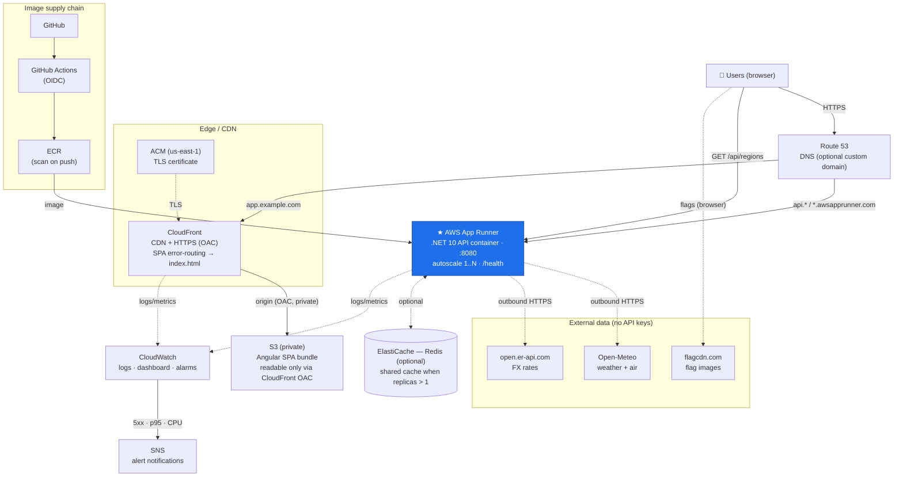

# WeatherApplication — AWS Architecture

Production topology for the two deployable units: the **Angular SPA** (static,
edge-delivered) and the **.NET 10 API** (container). Provisioned by the
Terraform in [`infra/`](infra/); deployed by [`.github/workflows/deploy.yml`](.github/workflows/deploy.yml).

---

## 1. High-level diagram

```
                                   ┌───────────┐
                                   │   Users    │  (browser)
                                   └─────┬─────┘
                                         │ HTTPS
                          ┌──────────────┴───────────────┐
                          │           Route 53            │  DNS (optional custom domain)
                          └──────┬─────────────────┬──────┘
                                 │                 │
                    app.example.com          api.example.com / *.awsapprunner.com
                                 │                 │
                    ┌────────────▼─────────┐       │
                    │      CloudFront       │       │   (TLS via ACM)
                    │   CDN + HTTPS (OAC)   │       │
                    └───────────┬───────────┘       │
                        (origin │ OAC, private)     │
                    ┌───────────▼───────────┐       │
                    │      S3 (private)      │       │   Angular SPA bundle
                    │   index.html, JS, CSS  │       │
                    └───────────────────────┘       │
                                                     │
                                         ┌───────────▼────────────┐
                                         │     AWS App Runner      │  .NET 10 API container
                                         │  autoscale 1..N, :8080  │  health check /health
                                         │  TLS terminated at edge │
                                         └───────────┬────────────┘
                                                     │ outbound HTTPS
                            ┌────────────────────────┼──────────────────────────┐
                            ▼                        ▼                           ▼
                     Open-Meteo             open.er-api.com                 flagcdn.com
                  (weather + air)            (FX rates)              (flag images, from browser)

  Image supply chain:  GitHub → GitHub Actions (OIDC) → ECR → App Runner
  Observability:       App Runner + CloudFront → CloudWatch (logs, dashboard, alarms → SNS)
  Optional at scale:   ElastiCache (shared cache) · WAF (edge) · Secrets Manager
```

### Rendered view (Mermaid)



**Fallback path:** if App Runner can't reach Open-Meteo/FX, the browser fetches
them directly and POSTs raw data to `/api/regions/merge`; the API still does all
merging/classification/localization. No business logic in the client.

---

## 2. Components

| Layer | AWS service | Role | Terraform |
| ----- | ----------- | ---- | --------- |
| DNS | **Route 53** | Domain → CloudFront / App Runner (optional) | `aws_route53_record.spa` |
| TLS | **ACM** (us-east-1) | Certificate for the custom domain | `aws_acm_certificate.spa` |
| Edge/CDN | **CloudFront** | HTTPS, caching, SPA error-routing to `index.html` | `aws_cloudfront_distribution.spa` + `origin_access_control` |
| SPA storage | **S3** (private) | Hosts the built Angular bundle; readable only via CloudFront OAC | `aws_s3_bucket.spa` + `bucket_policy` |
| API compute | **App Runner** | Runs the .NET container, autoscaling, `/health` probe | `aws_apprunner_service.api` |
| Image registry | **ECR** | Stores the API image (scan-on-push) | `aws_ecr_repository.api` |
| CI/CD | **GitHub Actions + OIDC** | Test → build/push image → deploy API → sync SPA | `.github/workflows/deploy.yml` |
| Monitoring | **CloudWatch + SNS** | Logs, dashboard, alarms (5xx, p95 latency, CPU) | `infra/monitoring.tf` |
| Cache (opt.) | **ElastiCache (Redis)** | Shared cache when running >1 instance | *add at scale* |
| Security (opt.) | **WAF**, **Secrets Manager** | Edge protection; secrets if keyed APIs added | *add as needed* |

---

## 3. Request flows

**A. First page load**
1. Browser resolves the domain (Route 53) → CloudFront.
2. CloudFront serves `index.html` + hashed JS/CSS from S3 (private, via OAC), cached at the edge.
3. Angular boots, detects locale, and calls the API.

**B. Live data**
1. SPA → `GET https://<api>/api/regions?lang=xx` (CORS-allowed origin).
2. App Runner returns cached, merged, **localized** data (weather + air + currency).
3. On cache miss the API fetches Open-Meteo + FX, merges, caches (1h), localizes per request.

**C. Fallback** (API host can't reach upstream)
1. `GET /api/regions` returns placeholder rows → SPA detects no live data.
2. SPA fetches `/api/countries`, calls Open-Meteo + FX from the browser, POSTs raw
   results to `/api/regions/merge` → API merges/classifies/localizes.

**D. Deploy**
1. Push to `main` → Actions runs backend + frontend tests.
2. Builds the API image, pushes to ECR, triggers App Runner deployment.
3. Builds the SPA (injecting the API URL), syncs to S3, invalidates CloudFront.

---

## 4. Security
- **S3 is private**; only this CloudFront distribution can read it (OAC + bucket policy `AWS:SourceArn`).
- **HTTPS everywhere** — CloudFront + App Runner terminate TLS; container honours `X-Forwarded-Proto`.
- **CORS** locked to the SPA origin (`Cors:AllowedOrigins`), not `*`.
- **No static AWS keys** — GitHub deploys via **OIDC** role assumption, least-privilege policy.
- **Container** runs as non-root on port 8080; image scanned on push.
- **Optional:** WAF on CloudFront (rate-limit/managed rules); Secrets Manager if upstream APIs ever require keys.

## 5. Scaling & availability
- **CloudFront** absorbs SPA traffic at the edge (global POPs).
- **App Runner** autoscales on concurrency (min 1 / max N); each region is multi-AZ managed by AWS.
- **Stateless API** + 1-hour cache → horizontal scale is safe; add **ElastiCache** so instances share the cache and stay within upstream rate limits.
- Multi-region is possible (CloudFront + per-region App Runner + latency routing) but not needed at this scale.

## 6. Cost (recap)
Minimal ~**$35–60/mo**, scalable ~**$90–130/mo** — full breakdown in
[PROJECT_PLAN.md §7](PROJECT_PLAN.md). Free Tier lowers year one.

## 7. Where it lives in code
```
infra/main.tf         ECR · App Runner · S3 · CloudFront (OAC) · Route53 · ACM · CloudWatch log group
infra/monitoring.tf   CloudWatch dashboard + alarms + SNS
infra/variables.tf    region, domain, sizing, alarm email
Dockerfile            API container (multi-stage, non-root, :8080)
.github/workflows/    CI/CD (OIDC → ECR → App Runner → S3/CloudFront)
DEPLOY.md             runbook + go-live checklist
```
